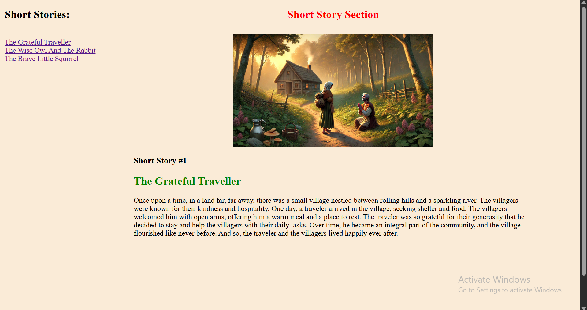
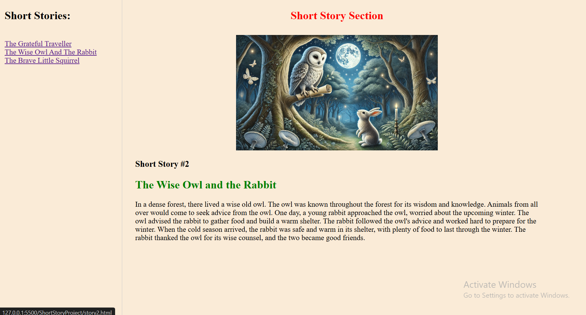
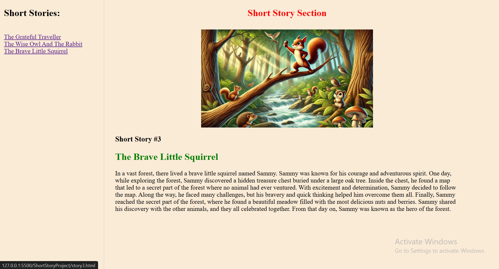

# 📖 Short Stories Navigator

A simple, lightweight HTML/CSS project that demonstrates dynamic content loading using an **iframe-based navigation system**. Users can browse a list of short stories from a sidebar menu, and each selected story loads instantly into the main content area — no page reloads required.

## ✨ Features

- **Sidebar Navigation** – Clean list of clickable story links
- **Dynamic Content Loading** – Stories load into an `<iframe>` without refreshing the page
- **Simple Layout** – Flexbox-based two-column design (Sidebar + Content)
- **Lightweight** – Pure HTML/CSS, no frameworks or dependencies

## 🗂️ Project Structure

```
├── index.html      # Main page with sidebar + iframe
├── story1.html      # The Grateful Traveller
├── story2.html      # The Wise Owl And The Rabbit
└── story3.html      # The Brave Little Squirrel
```

## 🚀 How It Works

The sidebar contains anchor (`<a>`) tags with a `target` attribute pointing to the iframe's `name`. Clicking a link loads the corresponding story file directly inside the iframe, keeping the sidebar and page layout intact.

```html
<a href="story1.html" target="contentFrame">The Grateful Traveller</a>
...
<iframe name="contentFrame" src="story1.html"></iframe>
```

## 📷 Preview
<p align="center">
  
  
  
</p>

## 🛠️ Technologies Used

- HTML5
- CSS3 (inline styling / Flexbox)

## 📌 How to Run

1. Clone or download the repository
2. Open `index.html` in any web browser
3. Click on any story title in the sidebar to view it

### 👨‍💻 Author
Hazem Ahmad
- GitHub: https://github.com/HazemAhmadHaz
- LinkedIn: https://www.linkedin.com/in/hazem-ahmad-haz
- Email: HazemAhmad01234@gmail.com

## 📄 License

This project is open-source and available for learning purposes.
